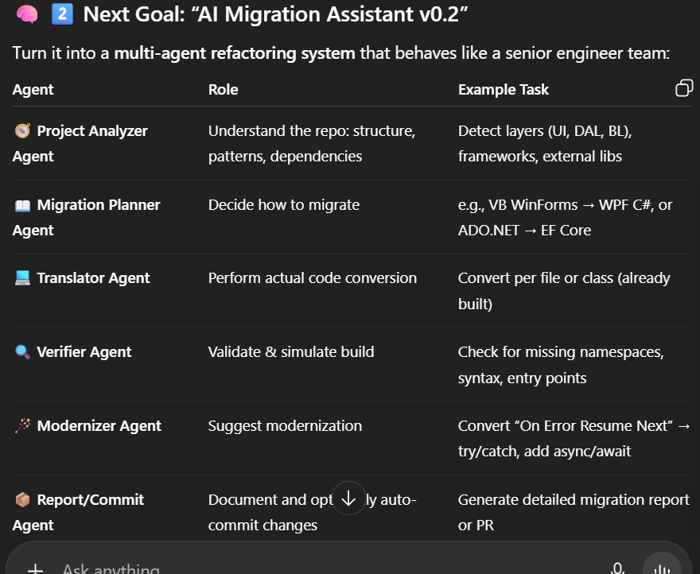

# Internal AI Pair Programmer at SAP for Legacy Code Migration

Internal AI Pair Programmer — an assistant that understands legacy code and helps refactor or migrate it intelligently.

Analyze a large legacy codebase (e.g., VB.NET), understand its structure and dependencies, and then automatically (or semi-automatically) suggest or perform transformations into a modern stack (e.g., C# or .NET 8).

# 🧩 1️⃣ Your Current System (MVP Stage)

Pipeline:
'''
Repo → VB Parser → Translator (LLM) → Report
'''

Core agent: “Translator Agent”

Works perfectly for direct function-level migration.

Lacks context awareness (it doesn’t know dependencies, architecture, or business logic).

No planning, no verification, no coordination.

# 🧠 2️⃣ Next Goal: “AI Migration Assistant v0.2”

⚙️ 3️⃣ Phase-Wise Roadmap
🧩 Phase 1 – Contextual Understanding (Today → Next 2 days)

Add a Project Analyzer stage that:

Maps repo structure (forms, modules, classes, configs).

Detects dependencies (Imports, .dll, .config references).

Outputs project_summary.json.

You can integrate tree-sitter or Roslyn analyzers for deeper AST parsing.

🧩 Phase 2 – Multi-Agent Orchestration (Week 1)

Use a Coordinator Agent to orchestrate LLM calls:

Coordinator → Analyzer → Planner → Translator → Verifier → Reporter

Each step can be a Python class or micro-process communicating via shared JSON.

🧠 Libraries to consider:

LangChain / LlamaIndex / CrewAI / Autogen — for agent orchestration

FastAPI or Flask backend — to serve multi-step migration jobs

🧩 Phase 3 – Semantic Migration & Context Retention

Add state memory so that when one agent translates a file, the next knows about class names, variables, and architecture context.

Implementation idea:

Store extracted symbols / functions in a lightweight SQLite DB.

Each agent reads/writes state to a shared vector memory (via FAISS or Chroma).

🧩 Phase 4 – Validation & Modernization

Plug in:

🧱 Roslyn CLI or dotnet build --dry-run to test generated code.

🧩 AutoFix Agent — uses analyzer feedback to patch code.

🧑‍💻 Modernization Patterns DB (mapping legacy → modern constructs).

🧩 Phase 5 – Optional GUI / VSCode Plugin

Wrap your CLI into a small dashboard:

FastAPI + Next.js for a web UI, or

VSCode extension using your backend REST API.

🧰 4️⃣ Tech Stack Upgrade
Layer Recommended
Core Agents Python + LangChain or Autogen
Parser Tree-sitter / Roslyn
Planning LLM Hermes-3 / Claude 3.5 / GPT-4o
Storage SQLite + FAISS (symbol embedding cache)
Verification dotnet SDK CLI
Visualization Streamlit / Rich TUI
