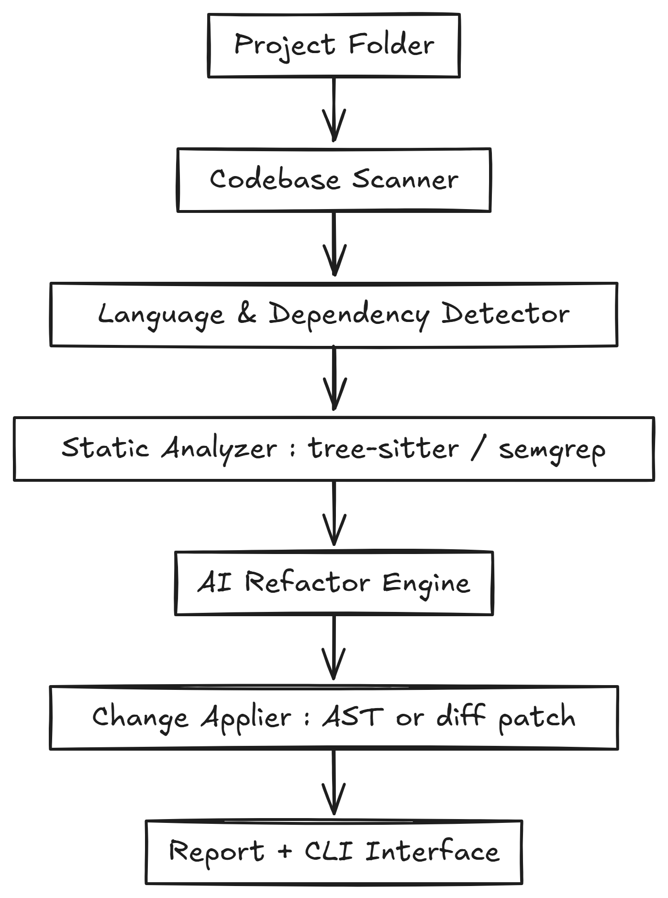

# Internal AI Pair Programmer at SAP for Legacy Code Migration

Internal AI Pair Programmer — an assistant that understands legacy code and helps refactor or migrate it intelligently.

Analyze a large legacy codebase (e.g., VB.NET), understand its structure and dependencies, and then automatically (or semi-automatically) suggest or perform transformations into a modern stack (e.g., C# or .NET 8).

# MVP Features (Realistic for Today)

## Feature Description Tools / Libs

1 Repo Loader Clone or open a GitHub/local repo, detect languages. gitpython, os, pathlib, langdetect
2 Code Parser Parse code files into ASTs (Abstract Syntax Trees). tree-sitter, libcst (for Python), Roslyn (for .NET), or jedi
3 Analyzer Engine Run static analysis to extract functions, complexity, TODOs, unused vars. radon, flake8, pylint, Roslyn analyzers
4 AI Suggestion Engine Feed summarized code into a local/remote LLM (like OpenAI, Ollama, or Hugging Face) for refactoring suggestions. openai / transformers
5 Refactoring Output Generate a report: “File → Issue → Suggested Fix.” Markdown/JSON report
6 Optional Auto-Fix Try safe automated fixes (like renaming or dead code removal). libcst / refurb / black / dotnet format
