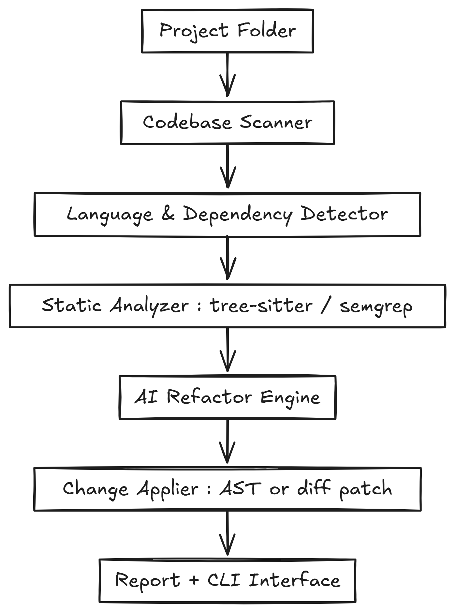
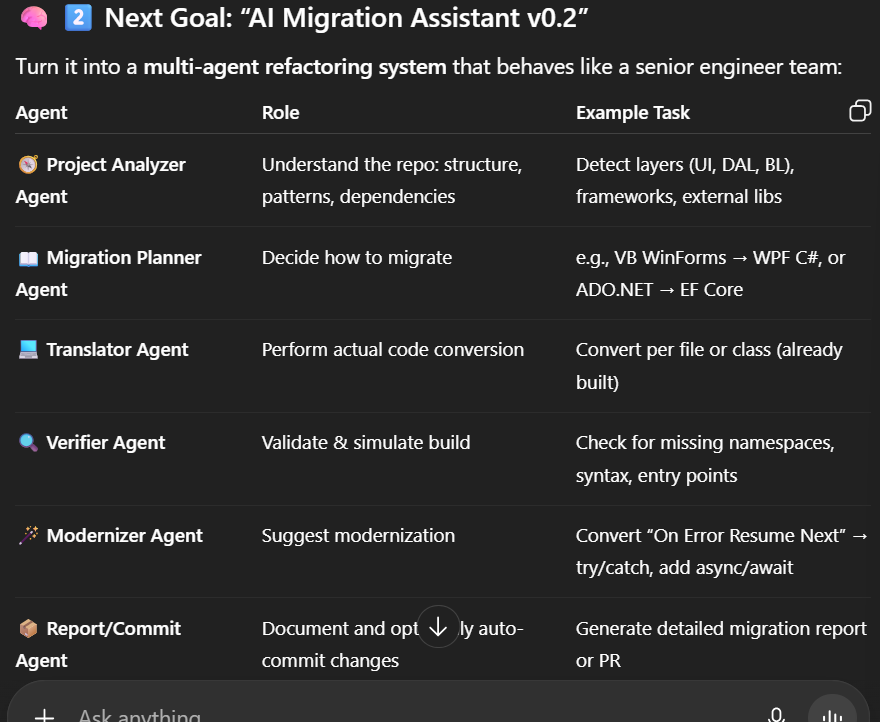

# 🤖 Internal AI Pair Programmer — Legacy Code Migration

An AI-powered pair programmer that understands legacy codebases and helps refactor or migrate them intelligently. Point it at a repository containing legacy code (e.g. VB.NET), and it will analyse the structure, detect dependencies, generate a migration plan, and produce translated C# output — all driven by a large language model of your choice.

## Demo




---

## ✨ Features

- **Language Detection** – automatically identifies the primary and secondary languages in a repository.
- **Project Analyser** – maps folder structure, files, and VB.NET `Imports` dependencies; outputs `reports/project_summary.json`.
- **File Annotator** – uses an LLM to write a one-line summary for every source file and saves them to `reports/annotations.json`.
- **Migration Planner** – generates a step-by-step, LLM-authored migration plan (saved to `reports/migration_plan.md`).
- **VB.NET → C# Translator** – extracts every `Sub`/`Function` from `.vb` files and produces idiomatic C# equivalents; saves a timestamped Markdown report under `reports/`.
- **Interactive Dashboard** – a Streamlit web UI with a live dependency graph, annotated file tree, and migration plan viewer.
- **Multi-provider LLM support** – plug in Gemini, OpenRouter, Hugging Face, or a local Ollama model via environment variables.

---

## 🏗️ Architecture

```
GitHub Repo / Local Folder
        │
        ▼
  repo_handler.py        ← clone or load the target repository
        │
        ├─► router_agent.py      ← detect languages
        ├─► analyser_agent.py    ← build project structure & dependency map
        ├─► annotator_agent.py   ← summarise every source file with an LLM
        ├─► vb_parser.py         ← extract VB.NET methods
        ├─► ai_refactor.py       ← translate VB.NET → C# via LLM
        ├─► planner_agent.py     ← generate migration plan via LLM
        └─► report_generator.py  ← save Markdown refactor report
```

All LLM calls are routed through `ai_provider.py`, which selects the configured backend.



---

## 🛠️ Prerequisites

| Requirement | Version            |
| ----------- | ------------------ |
| Python      | 3.10 +             |
| Git         | any recent version |

> A valid API key for your chosen LLM provider is required (see [Configuration](#️-configuration)).

---

## ⚙️ Setup

### 1. Clone this repository

```bash
git clone https://github.com/vanshika-hgnis/AIPairProgrammer_LegacyCodeMigration.git
cd AIPairProgrammer_LegacyCodeMigration
```

### 2. Create and activate a virtual environment (recommended)

```bash
python -m venv .venv

# macOS / Linux
source .venv/bin/activate

# Windows
.venv\Scripts\activate
```

### 3. Install dependencies

```bash
pip install -r requirements.txt
```

### 4. Configure environment variables

Create a file named `.env` in the project root and fill in your values:

```dotenv
# ── LLM Provider ──────────────────────────────────────────────
# Options: gemini | openrouter | huggingface | ollama
AI_PROVIDER=gemini

# ── API Keys (only the one matching your provider is required) ─
GEMINI_API_KEY=your_gemini_api_key_here
OPENROUTER_API_KEY=your_openrouter_api_key_here
HUGGINGFACE_API_KEY=your_huggingface_api_key_here

# ── Model selection (optional – sensible defaults are used) ────
# Gemini default  : gemini-2.0-flash-lite
# OpenRouter      : e.g. meta-llama/llama-3-8b-instruct
# Hugging Face    : e.g. mistralai/Mistral-7B-Instruct-v0.1
# Ollama          : e.g. llama3
MODEL=gemini-2.0-flash-lite
```

> **Ollama users:** make sure the Ollama server is running locally on `http://localhost:11434` before starting the tool.

---

## 🚀 Usage

### Option A — Interactive Dashboard (recommended)

Launch the Streamlit web UI:

```bash
streamlit run dashboard.py
```

Then open [http://localhost:8501](http://localhost:8501) in your browser.

**Workflow inside the dashboard:**

1. Paste a GitHub URL or a local folder path into the input box and click **🚀 Start Analysis**.
2. The tool clones the repo, detects languages, analyses the project structure, and annotates every file.
3. Browse the annotated file tree and the interactive dependency graph.
4. Choose a migration target language and click **🧩 Generate Migration Plan**.

### Option B — Command-line interface

Run the full pipeline (clone → parse → translate → report) from the terminal:

```bash
python main.py --repo https://github.com/your-org/legacy-vbnet-project
```

Use a local folder instead of a URL:

```bash
python main.py --repo /path/to/local/vbnet/project
```

**Output:** a timestamped Markdown report is written to the `reports/` directory.

---

## 📁 Project Structure

```
AIPairProgrammer_LegacyCodeMigration/
├── agents/
│   ├── analyser_agent.py    # Maps repo structure & VB.NET dependencies
│   ├── annotator_agent.py   # LLM-based per-file summarisation
│   ├── planner_agent.py     # Generates migration plan via LLM
│   └── router_agent.py      # Detects primary/secondary languages
├── other/
│   ├── Agents.png           # Architecture diagram
│   └── image.png            # Dashboard screenshot
├── repos/                   # Cloned target repos land here (git-ignored)
├── reports/                 # All generated reports land here (git-ignored)
├── test/                    # Manual test scripts
├── ai_provider.py           # Unified LLM client (Gemini / OpenRouter / HF / Ollama)
├── ai_refactor.py           # VB.NET → C# translation logic
├── dashboard.py             # Streamlit web UI
├── main.py                  # CLI entry-point
├── repo_handler.py          # Git clone / local folder loader
├── report_generator.py      # Markdown report writer
├── vb_parser.py             # Regex-based VB.NET method extractor
├── requirements.txt         # Python dependencies
└── .env                     # Your API keys (not committed)
```

---

## 🔌 Supported LLM Providers

| Provider                   | `AI_PROVIDER` value | Key env var                  |
| -------------------------- | ------------------- | ---------------------------- |
| Google Gemini              | `gemini`            | `GEMINI_API_KEY`             |
| OpenRouter                 | `openrouter`        | `OPENROUTER_API_KEY`         |
| Hugging Face Inference API | `huggingface`       | `HUGGINGFACE_API_KEY`        |
| Ollama (local)             | `ollama`            | _(none – runs on localhost)_ |

---

## 🗺️ Roadmap

| Phase | Goal                                                           | Status     |
| ----- | -------------------------------------------------------------- | ---------- |
| 1     | Contextual Understanding – project structure & dependency map  | ✅ Done    |
| 2     | Multi-Agent Orchestration (Analyser → Planner → Translator)    | ✅ Done    |
| 3     | Semantic Migration & context retention (SQLite / vector store) | 🔜 Planned |
| 4     | Validation – Roslyn / `dotnet build` feedback loop             | 🔜 Planned |
| 5     | VSCode extension or Next.js web UI                             | 🔜 Planned |

---

## 🤝 Contributing

Pull requests are welcome! Please open an issue first to discuss your proposed change.

---

## 📄 License

This project is for internal use. Contact the repository owner for licensing information.
